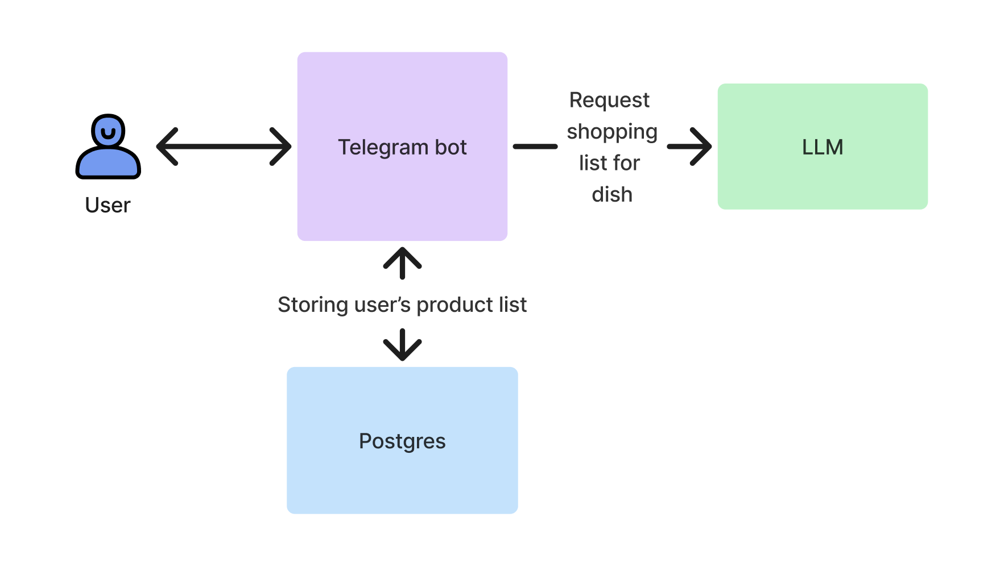

# What to buy?
**Ссылка на бота:** @what_to_buy_today_bot

**Телеграм бот позволяет создавать список продуктов и управлять им через встроенную клавиатуру телеграма**

### Инструкция по запуску бота:
`docker-compose up -d`

### Описание функциональности бота:

- Добавить продукт в список
- Посмотреть список продуктов
- Изменить статус продукта (нужно купить/уже куплен)
- Очистить список продуктов 
- Узнать какие продукты нужны для блюда: бот добавит необходимые продукты в список для указанного пользователем блюда

